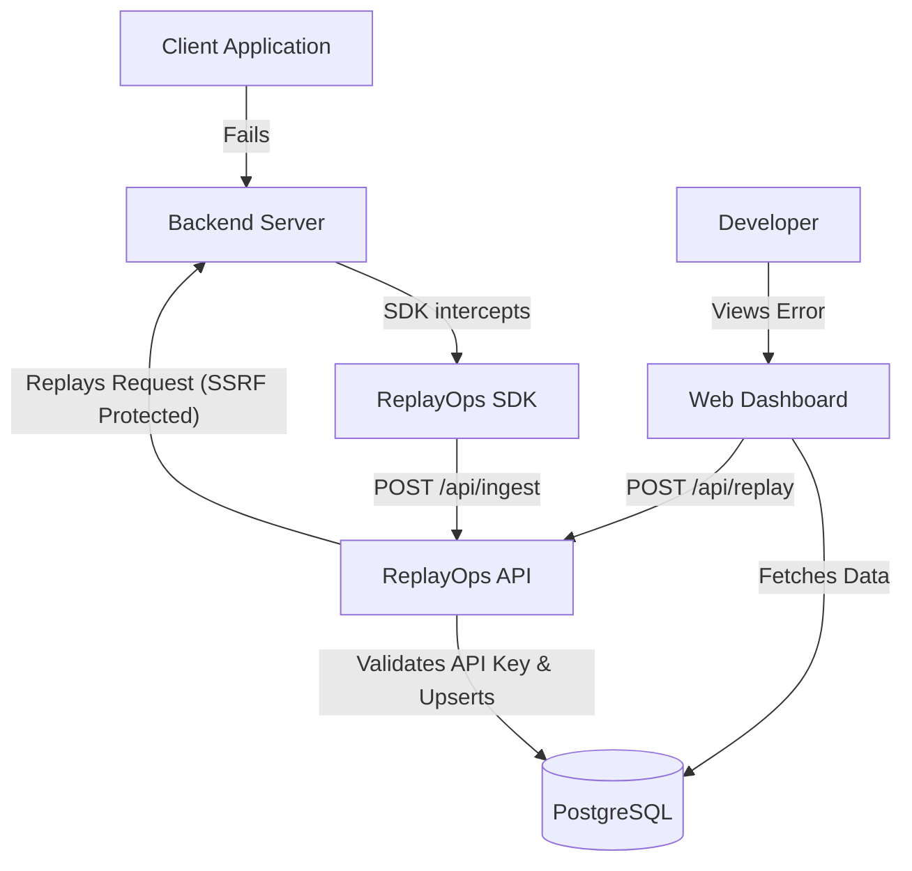

# 🚀 ReplayOps

ReplayOps is an observability and debugging platform built for modern development teams. It captures failing API requests in production, securely stores their contexts, and provides a powerful "time-travel" dashboard to replay and debug those exact requests locally or in isolated environments.

## 🏗️ Architecture

This project is a Monorepo managed with [Turborepo](https://turbo.build/repo), consisting of:

- **`apps/web`**: A modern Next.js 14 dashboard (App Router) for visualizing errors and triggering replays.
- **`apps/api`**: A blazing-fast Express backend for ingesting events and routing replays safely.
- **`packages/db`**: A centralized Prisma schema and database client using PostgreSQL.
- **`packages/replayops-sdk-node`**: An Express middleware SDK that automatically intercepts failures and reports them.

### 📐 System Flow



## 🚀 Quick Start (Running Locally)

To get ReplayOps running on your machine, follow these steps:

### 1. Environment Setup
Copy the example environment file and configure it:
```bash
cp .env.example .env
```

### 2. Start the Database
The project uses a PostgreSQL database. You can easily start it using Docker:
```bash
docker-compose up -d
```

### 3. Install Dependencies
Run the installation command at the root of the project to install packages for all workspaces:
```bash
npm install
```

### 4. Setup Prisma Schema
Synchronize your database with the Prisma schema (this will create all necessary tables):
```bash
npx prisma db push --schema=packages/db/prisma/schema.prisma
```

### 5. Start the Platform
Run the development server. This will concurrently start both the `web` dashboard and the `api` ingestion server:
```bash
npm run dev
```

The Dashboard will be available at: [http://localhost:3000](http://localhost:3000)

## 🧪 Testing the SDK

To see the platform in action, we have included a testing script that simulates a failing backend server using our SDK.

In a new terminal window, navigate to the SDK package and run the test script:
```bash
cd packages/replayops-sdk-node
npx tsx test-sdk.ts
```

Then, trigger a deliberate error by making a POST request to the test server:
```bash
# Se estiver no Windows PowerShell, use 'curl.exe'
curl -X POST http://localhost:3002/test-error
```

Head over to your Dashboard at `http://localhost:3000` to see the error appear in real-time, and click **Replay Event** to reconstruct and re-execute the failed request!
